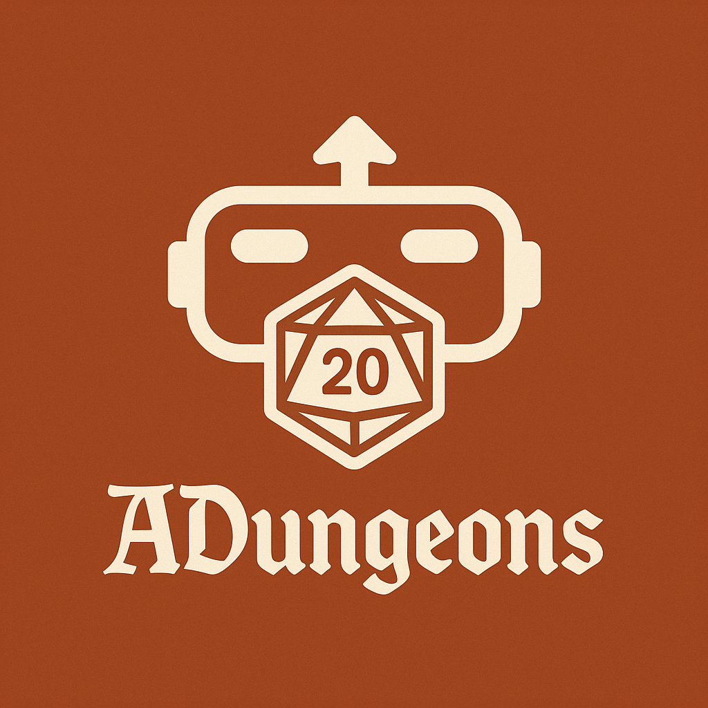

# ADungeons — Landing Page Oficial 

Este repositório contém a landing page oficial do **ADungeons**, um aplicativo de Realidade Aumentada (AR) que leva sua campanha de RPG de mesa a um novo nível de imersão. 
<br>
A proposta da página é apresentar o produto, funcionalidades, diferenciais e facilitar o acesso ao download do app (MVP) e materiais promocionais.

> 🎲 "Transforme sua mesa em um campo de batalha épico com ADungeons e seu celular."

## 🔗 Acesse a Página

> **[ADungeons - Elevando o RPG ao próximo nível](https://adungeons.github.io/landingpage/)**

---

## ✨ Principais Sessões da Landing Page

- **Seção Hero:** Chamada de impacto com botão para download do app
- **Demonstração em Vídeo:** Apresentação do funcionamento do app em AR
- **Funcionalidades:** O que o app faz e como melhora a experiência de RPG
- **Screenshots:** Prévia das interfaces para mestres e jogadores
- **FAQ:** Perguntas frequentes da comunidade
- **Call to Action:** Convite para baixar, testar ou apoiar o projeto

## 📁 Estrutura do Projeto

```bash
adungeons-landing/
├── index.html
├── css/
│   └── style.css
├── js/
│   └── main.js
├── assets/
│   ├── images/
└── README.md
